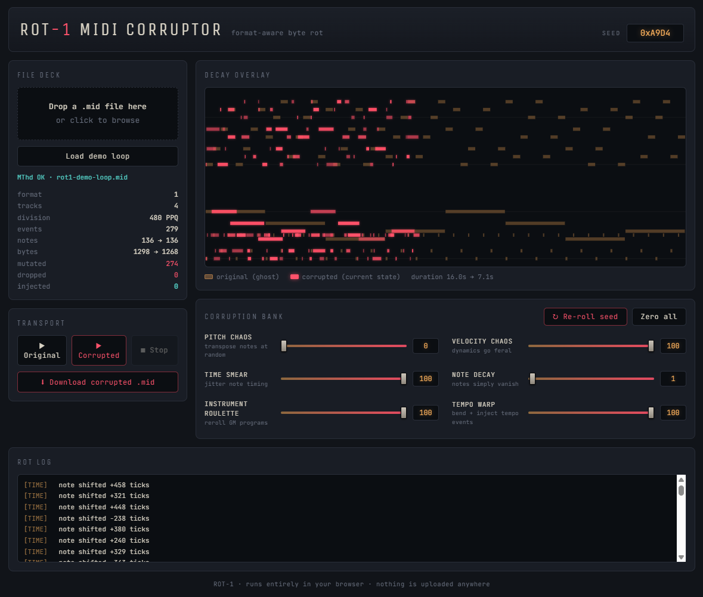

# ROT-1 — MIDI Corruptor

**Format-aware byte rot for Standard MIDI Files. Headers stay valid, the music doesn't.**

Drop in a `.mid` file, push the faders, and listen to it fall apart — then download the wreckage and open it in any DAW. Everything runs client-side in your browser; nothing is uploaded anywhere.

**▶ Live demo:** https://moxie-coder.github.io/ROT-1/



## Why "format-aware"?

Randomly flipping bytes in a MIDI file almost never produces glitchy music — it produces silence or a parser error. The format is fragile in three specific ways:

- **Delta times are variable-length quantities.** Flip the high bit of a VLQ byte and the parser desyncs from that point on.
- **Running status.** Files omit repeated status bytes, so corrupting one status byte misinterprets everything after it.
- **Track length headers.** `MTrk` chunks declare their byte length up front; insertions and deletions break parsing immediately.

ROT-1 instead fully parses the file (VLQs, running status, meta and sysex events included), mutates only the musical payload, and re-serializes with correct headers, lengths, and delta times. The output is a 100% valid SMF that any sequencer will open — it just sounds wrong in exactly the way you dialed in.

## The corruption bank

| Fader | What it rots |
|---|---|
| **Pitch chaos** | Randomly transposes notes (up to ±3 octaves at full tilt) |
| **Velocity chaos** | Randomizes note dynamics |
| **Time smear** | Jitters note timing by up to a full beat |
| **Note decay** | Notes simply vanish |
| **Instrument roulette** | Rerolls GM program changes — injects them on tracks that never had any |
| **Tempo warp** | Bends existing tempo events and injects random BPM lurches at high settings |

All corruption is **seeded**: the same seed + fader positions always produce the same result. Hit *Re-roll seed* for a fresh disaster with identical settings.

Note-offs follow their note-ons through pitch changes and deletions, so corrupted files never have stuck notes.

## Features

- **Decay overlay** — piano roll showing original notes as amber ghosts with the corrupted state burning on top, so you can see exactly what moved, mutated, or died
- **Rot log** — every individual mutation reported (`note E4 → G#7`, `120 → 832 BPM`)
- **A/B playback** — built-in Web Audio synth to compare original vs. corrupted, including tempo-warp time stretching
- **Valid output** — download as `.rot.mid`, verified against an independent parser ([@tonejs/midi](https://github.com/Tonejs/Midi))
- **Demo loop included** — try it without hunting for a MIDI file
- **Zero dependencies, zero backend** — one HTML file, works offline

## Usage

Open the [live demo](https://YOURUSER.github.io/midi-corruptor/), or clone and open locally:

```bash
git clone https://github.com/YOURUSER/midi-corruptor.git
cd midi-corruptor
xdg-open index.html   # or just double-click it
```

1. Drop a `.mid` file onto the deck (or click **Load demo loop**)
2. Push faders until it sounds appropriately broken
3. **▶ Corrupted** to preview, **⬇ Download** to export

## Limitations

- The preview synth is oscillator-based, not a soundfont — instrument roulette sounds far more dramatic in a real DAW than in the browser preview
- SMPTE-division files are handled with approximated timing
- Sysex and most meta events pass through untouched (only tempo gets warped)

## License

MIT — corrupt responsibly.
